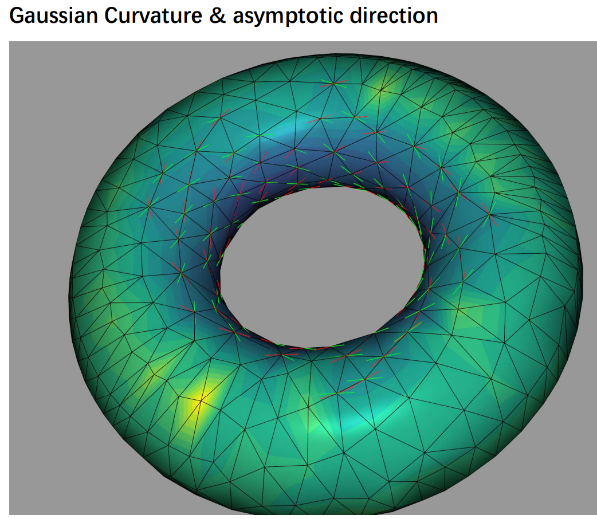
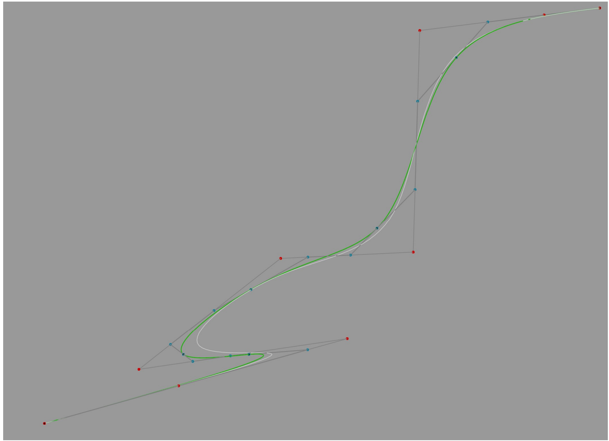
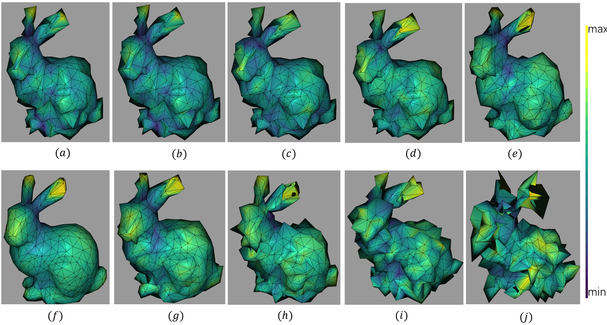
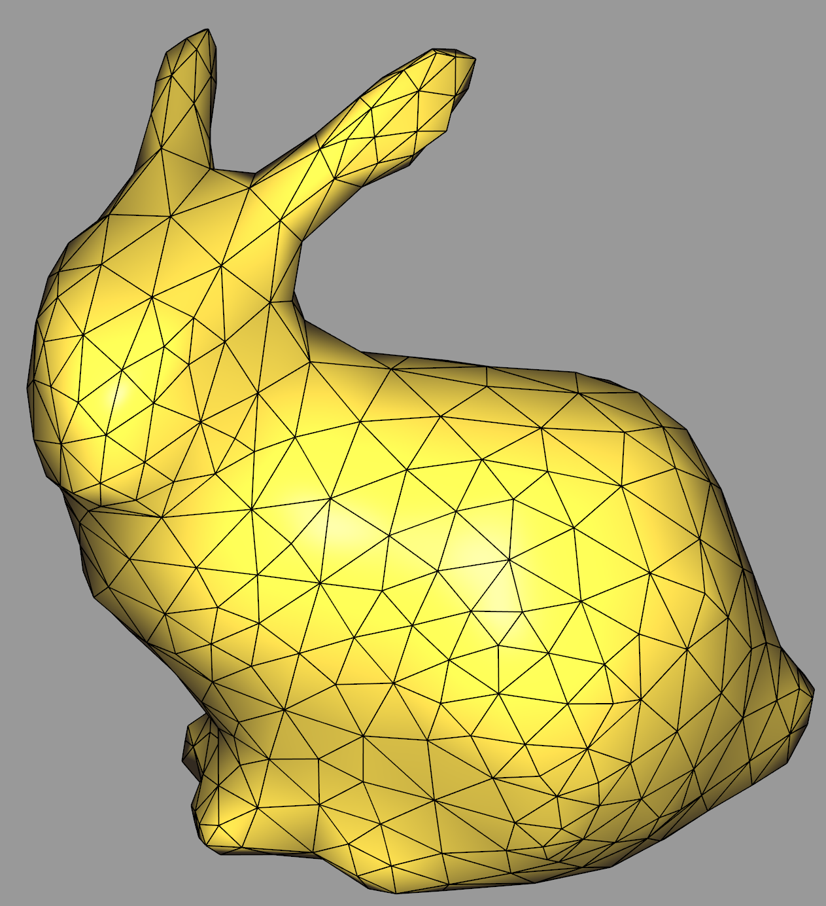
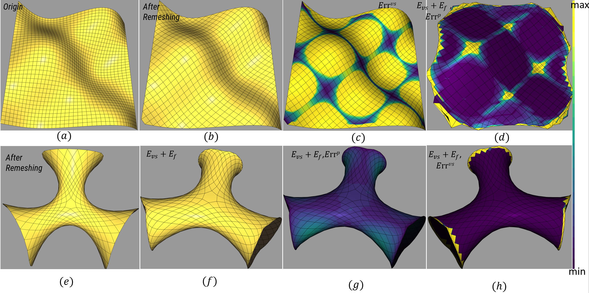
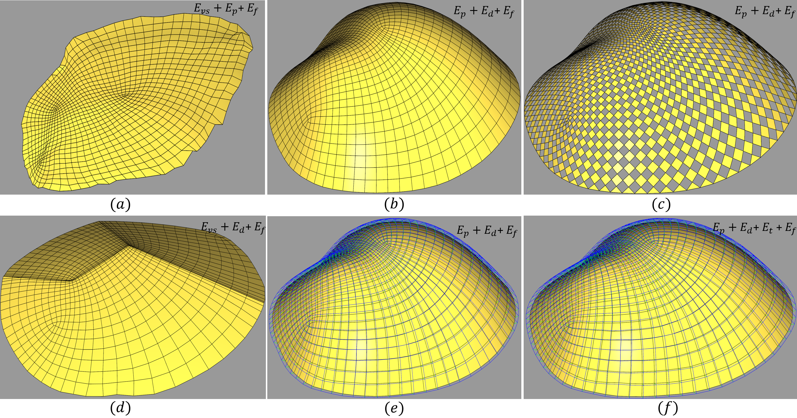

# CS272: Geometric Modeling
## Requirements and build:
This is a viewer application, using [GLFW](https://www.glfw.org), [Dear ImGui](https://github.com/ocornut/imgui), [Eigen](https://eigen.tuxfamily.org), and [OpenMesh](https://www.openmesh.org).
All dependencies are included in the `external` directory.
You can build this application with `cmake`. It has been tested under **Windows** and **Linux**.

## functionality:
0.Discrete Differential Geometery: estimate surface curvatures using Jit-fitting. 
1. Bezier Curve  &   Approximation of B-spline/interpolation of B-spline.
2. Discrete Differential Geometery: estimate surface curvatures using  Discrete Gauss-Bonet (Normal cycle).
3. Simple remesh.
4. Laplacian Smoothing of mesh.
5. Constrained Quad mesh   Optimization: co-planarity of vertex-star; co-planarity of quad;supporting structure; othorgonal quad constrain.

## Some Sample Result: 
Discrete Gausssian Curvature from jit-fitting.
B-spline interpolation .
Laplacian smoothing .
Laplacian smoothing .
quad mesh optimization .
quad mesh optimization .

